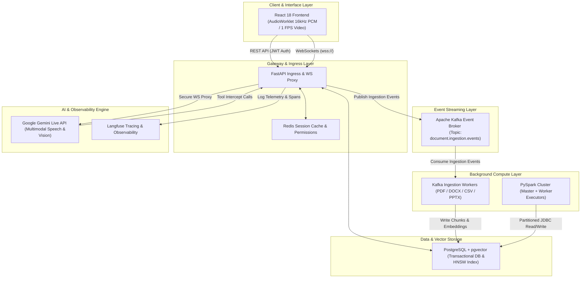

# EchoStack 🚀
### Enterprise Real-Time Multimodal Speech-to-Speech & Agentic RAG Ecosystem

[](https://python.org)
[](https://fastapi.tiangolo.com)
[](https://reactjs.org)
[](https://postgresql.org)
[](https://redis.io)
[](https://kafka.apache.org)
[](https://spark.apache.org)
[](https://www.docker.com)
[](https://developer.mozilla.org/en-US/docs/Web/API/WebSockets_API)
[](https://langfuse.com)
[](https://ai.google.dev)

---

## 🎬 Real-Time Multimodal Demo


> **Live Multimodal Interaction**: Low-latency bidirectional speech streaming, real-time webcam frame processing with spatial object detection overlays, hybrid RAG document search, and background PySpark ETL analytics.

---

## 📌 Executive Summary

**EchoStack** is an enterprise-grade agent platform engineered for ultra-low latency multimodal interaction, knowledge retrieval, and analytics. It bridges modern AI capabilities (speech-to-speech, vision analysis, hybrid RAG) with distributed data infrastructure (Apache Kafka, PySpark, PostgreSQL `pgvector`, Redis).

### Architecture Highlights:
- **Dual-Agent Architecture**:
  - **System 1 (Agent Orchestrator)**: LangChain-powered tool execution agent for hybrid RAG search, database querying, web searching, and sandboxed Python code interpretation.
  - **System 2 (Speech-to-Speech Engine)**: Real-time bidirectional WebSocket proxy interfacing directly with Google Gemini Live API for sub-second voice and visual interaction.
- **Asynchronous Document Pipeline**: Kafka-driven document parsing and vector embedding pipeline, isolating background ingestion tasks from client-facing REST APIs.
- **Distributed Big Data Analytics**: Containerized PySpark cluster performing scheduled batch aggregations and writing user engagement metrics back to PostgreSQL.
- **Full Observability**: End-to-end tracing across LLM calls, retriever lookups, tool executions, and voice streaming via self-hosted/cloud **Langfuse**.

---

## 🏗️ System Architecture



---

## 💡 Interactive Prompts & Feature Showcase

You can interact with **EchoStack** via speech (voice), text, or live camera feed. Below are example prompts showcasing the platform's capabilities:

### 🎙️ 1. Real-Time Speech & User Analytics
- **"Hey Echo, show me a summary of my account analytics and total interaction history for this week."**
  - *Behind the scenes*: Triggers `query_user_analytics` to query PostgreSQL DB and speak back an executive summary.
- **"What are my current account permissions and assigned security roles?"**
  - *Behind the scenes*: Checks RBAC permissions cached in Redis for fast validation.

### 👁️ 2. Multimodal Camera & Spatial Object Detection
- **"Look at what I am holding in front of the camera — identify the object and draw a bounding box around it."**
  - *Behind the scenes*: Processes 1 FPS JPEG video frames and returns `highlight_spatial_object` coordinates (`[ymin, xmin, ymax, xmax]`) to render real-time bounding box overlays on screen.
- **"Inspect the text on my screen and explain what this architecture diagram represents."**
  - *Behind the scenes*: Analyzes live screen-share frames and provides step-by-step visual explanations.

### 📚 3. Hybrid RAG Document Knowledge Search
- **"Search the knowledge base for our PostgreSQL vector indexing and deployment setup."**
  - *Behind the scenes*: Runs hybrid vector search (BAAI/bge-small-en-v1.5) + keyword search using Reciprocal Rank Fusion (**RRF**) against ingested `.pdf`, `.docx`, `.md`, or `.csv` files.
- **"What does section 2 of our architecture manual say about Kafka event ingestion topics?"**
  - *Behind the scenes*: Retrieves relevant document chunks and synthesizes exact section references.

### 🧮 4. Sandboxed Python Code Interpretation & Math
- **"Run a Python script to compute the 30-day compound growth rate on a $10,000 investment at 8.5% annual return."**
  - *Behind the scenes*: Executes code safely inside `python_code_interpreter` sandbox and returns exact math calculations.
- **"Calculate the mean and standard deviation for this dataset `[12, 45, 67, 89, 23, 56, 78]` using Python."**

### 🌐 5. Live Web Search & Fact Retrieval
- **"Search the web for the latest updates on Gemini Live API features and release notes."**
  - *Behind the scenes*: Invokes `web_search` tool (via Tavily / DuckDuckGo API) to fetch real-time facts and citations.

---

## 🛠️ Key Capabilities & Features

### 🎙️ Speech-to-Speech & Multimodal Vision
- **16kHz Int16 Downsampling**: Client-side `AudioWorklet` processor downsamples microphone input to 16kHz Int16 PCM chunks for low-overhead transmission.
- **24kHz High-Quality Audio Playback**: Incoming audio buffers are queued and scheduled via Web Audio API for smooth 24kHz voice output.
- **Spatial Object Detection**: Draws real-time 2D bounding box overlays (`[ymin, xmin, ymax, xmax]`) directly on live webcam feeds when the model identifies objects.

### 📚 Hybrid Knowledge Base & RAG Engine
- **Multi-Format Document Parsing**: Automatic text extraction and chunking for `.pdf`, `.docx`, `.txt`, `.csv`, `.md`, and `.pptx` files.
- **Reciprocal Rank Fusion (RRF)**: Merges dense semantic vector search scores with sparse keyword matches (`k=60`).

### 🔐 Security & Access Control (RBAC)
- **JWT Authorization**: Secure token generation signed with HS256 algorithm.
- **Redis Permission Caching**: User permissions (`can_query_analytics`, `can_write_knowledge`, `can_chat_live`) cached in Redis (`user_permissions:<user_id>`) for sub-millisecond RBAC validation.

### 📊 PySpark Batch Analytics Pipeline
- Partitioned JDBC reads from PostgreSQL database tables.
- Calculates user interaction metrics, top engagement topics, and activity timestamps.
- Writes aggregated insights back to PostgreSQL `user_analytics` table for instant agent querying.

---

## 📂 Repository Structure

```text
EchoStack/
├── backend/                  # FastAPI Core Gateway & Services
│   ├── api/                  # REST Endpoint Routers (Users, Auth, RAG)
│   ├── agent.py              # System 1 LangChain Agent & RAG Retriever
│   ├── analytics_job.py      # Apache Spark PySpark ETL Analytics Job
│   ├── auth.py               # JWT Validation & Redis Permission Cache
│   ├── db.py                 # PostgreSQL asyncpg Connection Pooling
│   ├── main.py               # FastAPI App & Database Seeding
│   ├── websocket.py          # Gemini Live Speech-to-Speech WS Proxy
│   └── worker.py             # Kafka Document Processing Worker
├── frontend/                 # React 18 Web Application
│   ├── src/
│   │   ├── App.jsx           # Multimodal Workspace Dashboard
│   │   ├── components/       # KnowledgeManager, AuthModal, VisionOverlay
│   │   └── index.css         # Styling & Design Tokens
│   └── public/
│       └── audio-processor.js # AudioWorklet Downsampler (16kHz PCM)
├── prompts/                  # System Prompts & Instruction Templates
│   └── system_session_prompt.md # Master Session System Prompt (Echo Persona)
├── postgres/                 # Database Initialization Scripts
│   └── init.sql              # Relational Schema & pgvector Extension Setup
├── tasks/                    # Task Specifications & Documentation
├── docker-compose.yml        # Infrastructure Orchestration (Postgres, Kafka, Redis, Spark)
├── pyproject.toml            # Python Dependencies & Poetry Config
└── start.ps1                 # Single-Click PowerShell Bootstrapper Script
```

---

## 🚀 Quickstart Guide

### Prerequisites
- **Python**: 3.11+ (managed via Poetry)
- **Node.js**: 18+ (managed via npm)
- **Docker & Docker Compose**: For database, messaging, and cache infrastructure
- **Google Gemini API Key**: Obtain from [Google AI Studio](https://aistudio.google.com)

### 1. Clone & Set Up Environment Variables
```bash
git clone https://github.com/rhythem27/EchoStack.git
cd EchoStack

# Copy example environment file
cp .env.example .env
```
Edit `.env` and set your `GEMINI_API_KEY`:
```env
GEMINI_API_KEY="your_actual_gemini_api_key_here"
```

### 2. Start Infrastructure Services (Docker)
Launch PostgreSQL (with `pgvector`), Redis, Apache Kafka, and PySpark:
```bash
docker-compose up -d
```

### 3. Install Dependencies & Seed Database
```bash
# Install backend Python dependencies
poetry install

# Run initial database migrations and seed default Super Admin
poetry run python -m backend.main
```

### 4. Run Backend & Frontend Servers

**Terminal 1 (Backend API & WS Server)**:
```bash
poetry run uvicorn backend.main:app --host 0.0.0.0 --port 8000 --reload
```

**Terminal 2 (Kafka Document Ingestion Worker)**:
```bash
poetry run python -m backend.worker
```

**Terminal 3 (React Frontend Web Portal)**:
```bash
cd frontend
npm install
npm run dev
```

Open [http://localhost:5173](http://localhost:5173) in your browser.

---

## 🧪 System Verification & Testing

### Automated Test Suite
Run backend unit and integration tests:
```bash
poetry run pytest
```

### Trigger PySpark Analytics Job
Manually execute the background PySpark ETL analytics pipeline:
```bash
poetry run python backend/analytics_job.py
```

---

## 📄 License

Distributed under the MIT License. See `LICENSE` for more information.