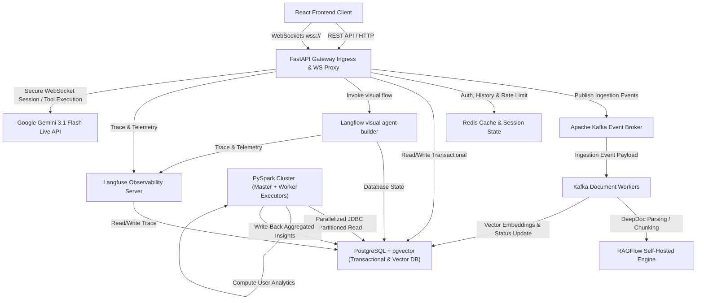
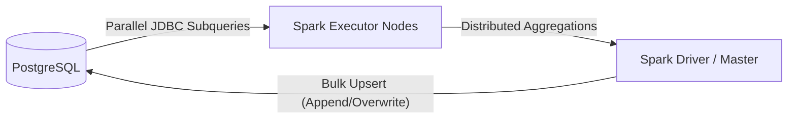

# Enterprise AI Agent & Real-Time Speech-to-Speech Architecture

This document specifies the software architecture design for the dual-system agentic platform:
1. **General Agent System (System 1)**: Visual & code-based orchestrator, RAG system, telemetry, and background ETL analytics.
2. **Speech-to-Speech Agent (System 2)**: Bidirectional, low-latency audio stream using Gemini 3.1 Flash Live, secured behind a FastAPI WebSocket proxy.

---

## 1. System Topology Overview

The deployment operates as a containerized microservices topology. The diagram below illustrates how raw user interactions, analytical flows, document ingestion streams, and live audio pathways route through the system.



---

## 2. Database Architecture & Vector Storage Mechanics

PostgreSQL handles both transactional state (ACID compliant user records, permissions, documents) and high-dimensional semantic vector chunk storage.

### 2.1 Relational Schema & Role-Based Access Control (RBAC)

The relational schema strictly maps users to roles to ensure fine-grained authorization intercepts can query the authorization state at runtime.

#### Table: `roles`
Stores role configuration and permissions maps.
```sql
CREATE TABLE roles (
    id SERIAL PRIMARY KEY,
    role_name VARCHAR(50) UNIQUE NOT NULL,
    permissions JSONB NOT NULL DEFAULT '{}'::jsonb
);
```

#### Table: `users`
Stores user authentication hashes.
```sql
CREATE TABLE users (
    id UUID PRIMARY KEY DEFAULT gen_random_uuid(),
    email VARCHAR(255) UNIQUE NOT NULL,
    password_hash VARCHAR(255) NOT NULL,
    role_id INT REFERENCES roles(id) ON DELETE RESTRICT,
    created_at TIMESTAMP WITH TIME ZONE DEFAULT CURRENT_TIMESTAMP
);
```

#### Table: `user_profiles`
Maintains preferences and tiers, queried directly by the LLM as a context enhancement tool.
```sql
CREATE TABLE user_profiles (
    user_id UUID PRIMARY KEY REFERENCES users(id) ON DELETE CASCADE,
    preferences JSONB NOT NULL DEFAULT '{}'::jsonb,
    usage_tier VARCHAR(50) NOT NULL DEFAULT 'standard'
);
```

#### Table: `user_analytics`
Aggregated session insights written strictly by PySpark batch jobs. Queried by the LangChain agent.
```sql
CREATE TABLE user_analytics (
    user_id UUID PRIMARY KEY REFERENCES users(id) ON DELETE CASCADE,
    total_interactions INT NOT NULL DEFAULT 0,
    top_topics JSONB NOT NULL DEFAULT '[]'::jsonb,
    last_updated_at TIMESTAMP WITH TIME ZONE DEFAULT CURRENT_TIMESTAMP
);
```

#### Table: `documents`
Tracks files uploaded for asynchronous ingest.
```sql
CREATE TABLE documents (
    id UUID PRIMARY KEY DEFAULT gen_random_uuid(),
    user_id UUID REFERENCES users(id) ON DELETE CASCADE,
    file_name VARCHAR(555) NOT NULL,
    status VARCHAR(50) NOT NULL DEFAULT 'PENDING', -- PENDING, PROCESSING, COMPLETE, FAILED
    created_at TIMESTAMP WITH TIME ZONE DEFAULT CURRENT_TIMESTAMP
);
```

#### Table: `vector_knowledge`
Stores text chunks and their high-dimensional vector embeddings.
```sql
CREATE EXTENSION IF NOT EXISTS vector;

CREATE TABLE vector_knowledge (
    id UUID PRIMARY KEY DEFAULT gen_random_uuid(),
    doc_id UUID REFERENCES documents(id) ON DELETE CASCADE,
    chunk_text TEXT NOT NULL,
    embedding VECTOR(3072) NOT NULL -- text-embedding-3-large produces 3072 dimensions
);
```

### 2.2 Vector Indexing Mathematics & Optimization

To achieve fast lookup speeds, an **HNSW (Hierarchical Navigable Small World)** index is constructed on `vector_knowledge.embedding`.

#### 1. Distance Metric: Cosine Similarity
Cosine similarity evaluates the orientation of vectors regardless of their magnitude:

$$\text{Cosine Similarity} = \cos(\theta) = \frac{\mathbf{A} \cdot \mathbf{B}}{\|\mathbf{A}\| \|\mathbf{B}\|} = \frac{\sum_{i=1}^{n} A_i B_i}{\sqrt{\sum_{i=1}^{n} A_i^2} \sqrt{\sum_{i=1}^{n} B_i^2}}$$

In `pgvector`, cosine distance is represented by the `<=>` operator:
$$\text{Cosine Distance} = 1 - \text{Cosine Similarity}$$

#### 2. Index Construction Configuration
```sql
CREATE INDEX idx_vector_knowledge_hnsw_cosine 
ON vector_knowledge 
USING hnsw (embedding vector_cosine_ops)
WITH (m = 16, ef_construction = 64);
```
- **`m` (16)**: Max number of bidirectional links per node in the graph layers. Controlling this balances recall against index size.
- **`ef_construction` (64)**: Size of the dynamic candidate list evaluated during graph construction. Increasing this improves search quality at the expense of indexing build time.

#### 3. PostgreSQL Server Configuration Optimization
To prevent disk spilling during the construction of large HNSW index graphs:
```ini
# postgresql.conf
maintenance_work_mem = 8GB  # Allocates memory budget for building indices
max_parallel_maintenance_workers = 4 # Parallelized indexing
```

---

## 3. Distributed Big Data Analytics via PySpark

To scale without blocking transactional query pathways, session logs are processed in a distributed manner via Apache Spark.



### Partitioning JDBC Read Strategy
To parallelize the query across Spark Executors, we partition the dataset along a numeric or date column (e.g., interaction timestamps or serial IDs):
- **`partitionColumn`**: Primary numeric/timestamp key.
- **`lowerBound`**: Lower limit for partition stride calculations.
- **`upperBound`**: Upper limit for partition stride calculations.
- **`numPartitions`**: Total database connections allowed during load.
- **`fetchsize`**: The exact record count streamed per socket read call (prevents out-of-memory errors on Spark nodes).

---

## 4. Cache & Event Streaming Layer (Redis & Kafka)

- **Apache Kafka**: Decouples standard API handlers from compute-heavy pipelines. Uploading a document emits an ingestion payload containing file metadata into Kafka, immediately returning `202 Accepted` to the client.
- **Redis**: Fast RAM cache serving:
  1. **JWT & Permissions Cache**: Intercepts REST and WebSocket routes.
  2. **LangChain rolling chat buffer**: Fetches the sliding conversational history frame.
  3. **Token Bucket Rate Limiting**: Tracks user requests per minute (e.g. Standard: 10/min, Premium: 50/min).
