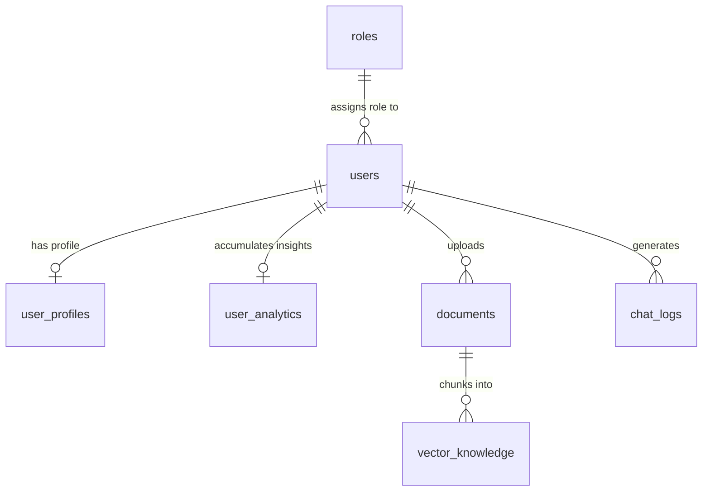

# Database Tables & System Business Rules Reference

This reference document provides an exhaustive catalog of all database tables, schemas, Role-Based Access Control (RBAC) permissions, tool execution priority rules, vector indexing configurations, and operational business logic across the EchoStack architecture.

---

## 1. Relational & Vector Database Tables Catalog

All tables are hosted in the **PostgreSQL + pgvector** database instance ([postgres/init.sql]).



---

### 1.1 Table: `roles`
- **Purpose**: Defines system access tiers and JSON permission mappings for Role-Based Access Control (RBAC).
- **Primary Keys & Constraints**: `id` (SERIAL Primary Key), `role_name` (UNIQUE VARCHAR 50).

#### Schema:
| Column | Type | Constraints | Description |
| :--- | :--- | :--- | :--- |
| `id` | `SERIAL` | `PRIMARY KEY` | Unique role ID (`1` = Admin, `2` = Premium, `3` = Standard). |
| `role_name` | `VARCHAR(50)` | `UNIQUE, NOT NULL` | Human-readable role identifier. |
| `permissions` | `JSONB` | `NOT NULL DEFAULT '{}'` | JSON object defining boolean permission flags. |

#### Seeded Data & Permission Maps:
```sql
INSERT INTO roles (id, role_name, permissions) VALUES 
(1, 'admin', '{"can_access_admin_tools": true, "can_query_analytics": true, "can_write_knowledge": true, "can_chat_live": true}'),
(2, 'premium', '{"can_access_admin_tools": false, "can_query_analytics": true, "can_write_knowledge": true, "can_chat_live": true}'),
(3, 'standard', '{"can_access_admin_tools": false, "can_query_analytics": false, "can_write_knowledge": false, "can_chat_live": true}');
```

---

### 1.2 Table: `users`
- **Purpose**: Core user identity records and authentication credentials.
- **Primary Keys & Foreign Keys**: `id` (UUID Primary Key), `role_id` (References `roles(id)` ON DELETE RESTRICT).

#### Schema:
| Column | Type | Constraints | Description |
| :--- | :--- | :--- | :--- |
| `id` | `UUID` | `PRIMARY KEY DEFAULT gen_random_uuid()` | Unique user identifier. |
| `email` | `VARCHAR(255)` | `UNIQUE, NOT NULL` | User email address. |
| `password_hash` | `VARCHAR(255)` | `NOT NULL` | Hashed password string. |
| `role_id` | `INT` | `FOREIGN KEY (roles.id)` | Role reference for RBAC authorization. |
| `created_at` | `TIMESTAMPTZ` | `DEFAULT CURRENT_TIMESTAMP` | Account creation timestamp. |

#### Default System Seed:
- **Default System User UUID**: `00000000-0000-0000-0000-000000000000` (`system@echostack.io`, Role: `admin`).

---

### 1.3 Table: `user_profiles`
- **Purpose**: Holds user preferences and account tier metadata, queried by LLM agent tools for context enhancement.
- **Foreign Keys**: `user_id` (References `users(id)` ON DELETE CASCADE).

#### Schema:
| Column | Type | Constraints | Description |
| :--- | :--- | :--- | :--- |
| `user_id` | `UUID` | `PRIMARY KEY, FOREIGN KEY` | Owner user UUID. |
| `preferences` | `JSONB` | `NOT NULL DEFAULT '{}'` | UI/Voice preferences (e.g. voice selection, theme). |
| `usage_tier` | `VARCHAR(50)` | `NOT NULL DEFAULT 'standard'` | Account rate limit tier (`standard`, `premium`). |

---

### 1.4 Table: `user_analytics`
- **Purpose**: Aggregated user engagement analytics compiled by distributed **PySpark ETL batch jobs** ([backend/analytics_job.py]).
- **Foreign Keys**: `user_id` (References `users(id)` ON DELETE CASCADE).

#### Schema:
| Column | Type | Constraints | Description |
| :--- | :--- | :--- | :--- |
| `user_id` | `UUID` | `PRIMARY KEY, FOREIGN KEY` | Owner user UUID. |
| `total_interactions` | `INT` | `NOT NULL DEFAULT 0` | Total message & voice interactions. |
| `top_topics` | `JSONB` | `NOT NULL DEFAULT '[]'` | Top topics extracted from conversation logs. |
| `last_updated_at` | `TIMESTAMPTZ` | `DEFAULT CURRENT_TIMESTAMP` | PySpark ETL last execution timestamp. |

---

### 1.5 Table: `documents`
- **Purpose**: Tracks PDF files uploaded for RAG ingestion and their processing lifecycle status.
- **Foreign Keys**: `user_id` (References `users(id)` ON DELETE CASCADE).

#### Schema:
| Column | Type | Constraints | Description |
| :--- | :--- | :--- | :--- |
| `id` | `UUID` | `PRIMARY KEY DEFAULT gen_random_uuid()` | Document ID. |
| `user_id` | `UUID` | `FOREIGN KEY` | Owner user UUID. |
| `file_name` | `VARCHAR(555)` | `NOT NULL` | Original uploaded PDF filename. |
| `status` | `VARCHAR(50)` | `NOT NULL DEFAULT 'PENDING'` | Lifecycle state (`PENDING`, `PROCESSING`, `COMPLETE`, `FAILED`). |
| `created_at` | `TIMESTAMPTZ` | `DEFAULT CURRENT_TIMESTAMP` | Upload timestamp. |

---

### 1.6 Table: `vector_knowledge`
- **Purpose**: Vector database table storing document text chunks and high-dimensional semantic embeddings generated by CUDA-accelerated models (`BAAI/bge-small-en-v1.5`, 384 dimensions).
- **Foreign Keys**: `doc_id` (References `documents(id)` ON DELETE CASCADE).

#### Schema:
| Column | Type | Constraints | Description |
| :--- | :--- | :--- | :--- |
| `id` | `UUID` | `PRIMARY KEY DEFAULT gen_random_uuid()` | Knowledge chunk ID. |
| `doc_id` | `UUID` | `FOREIGN KEY` | Source document ID. |
| `chunk_text` | `TEXT` | `NOT NULL` | Extracted layout text/table chunk. |
| `embedding` | `VECTOR(384)` | `NOT NULL` | 384-dimensional floating point vector. |

#### Vector HNSW Indexing Configuration:
```sql
CREATE INDEX idx_vector_knowledge_hnsw_cosine 
ON vector_knowledge 
USING hnsw (embedding vector_cosine_ops)
WITH (m = 16, ef_construction = 64);
```
- **HNSW Distance Metric**: Cosine Similarity distance (`<=>` operator in `pgvector`).
- **Graph Construction Parameters**:
  - `m = 16`: Maximum number of bidirectional links per node in graph layers.
  - `ef_construction = 64`: Dynamic candidate evaluation queue size during index build.

---

### 1.7 Table: `chat_logs`
- **Purpose**: Raw conversation telemetry logging interaction messages between users and agents.
- **Foreign Keys**: `user_id` (References `users(id)` ON DELETE CASCADE).

#### Schema:
| Column | Type | Constraints | Description |
| :--- | :--- | :--- | :--- |
| `id` | `SERIAL` | `PRIMARY KEY` | Telemetry log ID. |
| `user_id` | `UUID` | `FOREIGN KEY` | User UUID. |
| `message_text` | `TEXT` | `NOT NULL` | Message content or transcript snippet. |
| `created_at` | `TIMESTAMPTZ` | `DEFAULT CURRENT_TIMESTAMP` | Log timestamp. |

---

## 2. System Business Rules & Logic Catalog

### 2.1 Role-Based Access Control (RBAC) Authorization Rules

When an endpoint or tool is invoked, [backend/auth.py] evaluates authorization:

| Rule Name | Required Permission Flag | Target Endpoint / Function | Action on Denied |
| :--- | :--- | :--- | :--- |
| **Analytics Query** | `can_query_analytics` | `query_user_analytics()` | Returns `"Authorization Failure: User lacks required permission 'can_query_analytics'."` |
| **RAG Vector Search** | `can_write_knowledge` | `rag_knowledge_search()` | Returns `"Authorization Failure: User lacks required permission 'can_write_knowledge'."` |
| **Live Speech Proxy** | `can_chat_live` | `/ws/speech` WebSocket | Closes WebSocket with `WS_1008_POLICY_VIOLATION`. |
| **Admin Tools Access** | `can_access_admin_tools` | Admin APIs | Returns HTTP 403 Forbidden. |

---

### 2.2 Live Speech Tool Execution Priority Rules

In [backend/websocket.py], tool execution during Gemini Live speech sessions follows strict scheduling priorities:

| Tool Name | Priority Rule | Behavior During Live Audio Output |
| :--- | :--- | :--- |
| `rag_knowledge_search` | **`INTERRUPT`** | Immediately halts ongoing Gemini voice output, executes the RAG similarity search, and speaks the factual document answer to the user. |
| `query_user_analytics` | **`WHEN_IDLE`** | Waits until the current spoken phrase/turn finishes before executing the analytics query and reporting results. |

---

### 2.3 Audio Stream Processing & Interruption (Barge-In) Rules

1. **Microphone Audio Input**:
   - Format: 16kHz Int16 raw PCM audio chunks (30ms frames, 480 samples).
   - Transmission: Encoded as Base64 JSON payloads over WebSocket (`ws.send({ type: "audio_chunk", data: b64 })`).
2. **AI Speaker Output**:
   - Format: 24kHz Int16 raw PCM audio chunks.
   - Playback: Scheduled seamlessly via HTML5 `AudioContext` and dynamic Web Audio buffer queues.
3. **Voice Activity Detection (VAD) Barge-In Rule**:
   - When Gemini detects user speech while AI audio is playing, Gemini emits a WebSocket `interrupted` event.
   - The frontend immediately flushes all scheduled Web Audio sources and halts playback instantly.

---

### 2.4 Asynchronous Document Ingestion Lifecycle Rules

```
User Upload PDF ──► 1. Save /tmp/uploads ──► 2. DB INSERT PENDING ──► 3. Kafka Event Publish (document.ingestion.events)
                                                                                  │
                                                                                  ▼
Postgres COMPLETE ◄── 6. Save Vector (HNSW) ◄── 5. Embed (bge-small) ◄── 4. Docling Markdown Worker
```

1. **File Type Rule**: Only PDF files are accepted (`/upload-document`). Non-PDF files return HTTP 400 Bad Request.
2. **Status Transitions**: `PENDING` $\rightarrow$ `PROCESSING` $\rightarrow$ `COMPLETE` (or `FAILED` on exception).
3. **Worker Processing**:
   - Layout-aware optical parsing via **Docling DocumentConverter**.
   - Header-aware chunking using `MarkdownHeaderTextSplitter`.
   - CUDA GPU-accelerated embedding generation using `BAAI/bge-small-en-v1.5` (384 dimensions).
   - Automatic temp file cleanup after ingestion completes.

---

## 3. Reference Summary

For implementation details and source code:
- Schema Definition: [postgres/init.sql]
- RBAC Middleware: [backend/auth.py]
- WebSocket Proxy & Tool Priority: [backend/websocket.py]
- RAG & Tool Definitions: [backend/agent.py]
- Background Ingestion Worker: [backend/worker.py]
