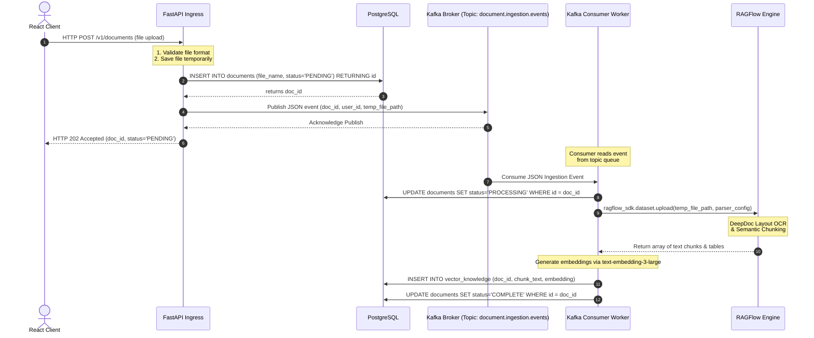
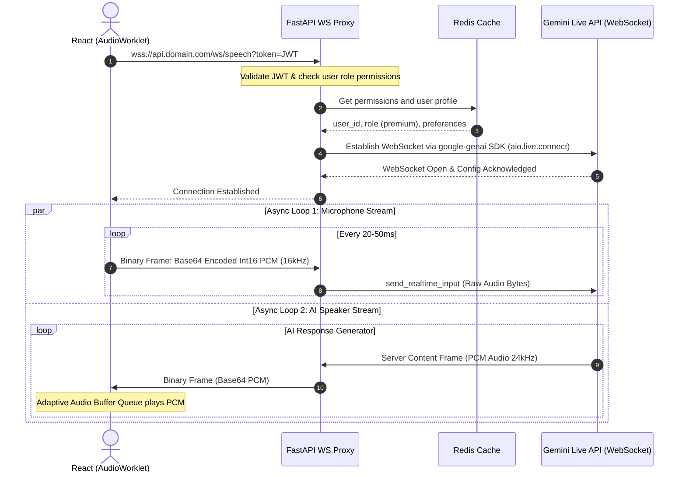
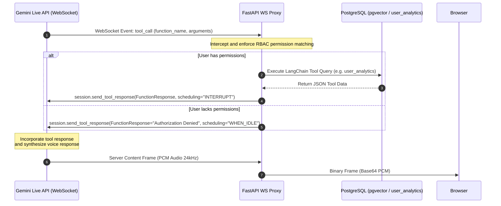
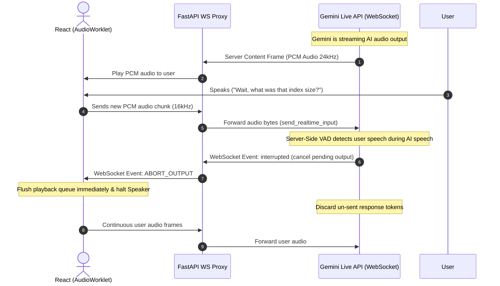

# System Control & Data Flows

This document details the step-by-step sequencing for critical workloads in the dual-system agentic architecture.

---

## 1. Asynchronous Document Ingestion Flow

The document ingestion workflow handles large PDF, OCR, and table extractions asynchronously, decoupling client requests via Kafka and RAGFlow.



### Event Payload Example (Kafka Topic: `document.ingestion.events`)
```json
{
  "event_id": "8fa1119b-c40d-4001-a20d-dcd6b60e657c",
  "timestamp": "2026-07-14T18:05:00Z",
  "user_id": "c13886b4-f6b7-4c4f-9dbb-8ccdc678cb2d",
  "doc_id": "a98cc8b4-023a-4a6c-9c09-cdab900a892b",
  "file_path": "/tmp/uploads/quarterly_report_2026.pdf",
  "parser_config": {
    "chunk_token_num": 512,
    "layout_recognize": true,
    "chunk_method": "naive"
  }
}
```

---

## 2. Real-Time Speech-to-Speech Flow

System 2 avoids cascading STT/TTS models by proxying a raw PCM stream from the browser through FastAPI to Gemini 3.1 Flash Live.



---

## 3. Real-Time Asynchronous Tool Calling Flow

When the user asks for data stored in PostgreSQL or documents processed by RAGFlow, the Gemini model initiates a mid-stream tool execution request.



---

## 4. Speech Interruption & Barge-In Mechanics

A fluid voice interface must support sudden interruptions. The system utilizes Gemini's Server-Side Voice Activity Detection (VAD) to interrupt AI generation instantly.


