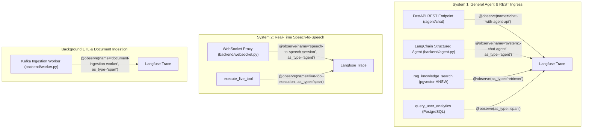

# For langfuse stack: https://github.com/langfuse/skills

# Agentic Skills & Observability Integration Reference

This document specifies the agentic skills framework implemented in EchoStack, detailing how specialized skills are structured under `.agents/skills/` and integrated into the dual-system agent architecture.

---

## 1. Agentic Skills Architecture

EchoStack utilizes modular agent skills to extend agent capabilities for observability, telemetry, prompt engineering, and operational evaluation. Skills are stored under the workspace customization root (`.agents/skills/`) and automatically loaded by agentic runtime environments.

```
.agents/skills/
└── langfuse/
    ├── SKILL.md                 # Primary skill instructions & YAML frontmatter
    ├── AGENTS.md                # Multi-agent capabilities & guidelines
    ├── assets/                  # Diagrams & visual assets
    └── references/              # Detailed execution guides
        ├── instrumentation.md   # Application tracing best practices
        ├── cli.md               # CLI commands for Langfuse API
        ├── prompt-migration.md  # Migrating prompts to Langfuse Prompt Management
        └── prompt-engineering.md# Iterative prompt tuning guidelines
```

---

## 2. Installed Skill: Langfuse AI Skill

- **Repository Source**: `github.com/langfuse/skills`
- **Primary Use Cases**:
  1. **Observability & Tracing**: Automatic capturing of model input/output, token counts, latency, and span hierarchies across multi-turn sessions.
  2. **CLI Data Access**: Programmatic querying of traces, sessions, scores, and prompts via `npx langfuse-cli`.
  3. **Evaluation & Quality Assurance**: Dataset curation, score logging, and LLM-as-a-judge evaluators.

---

## 3. EchoStack System Tracing Alignment

The Langfuse skill guidelines ([references/instrumentation.md]) are directly aligned with EchoStack's dual-system architecture:



### 3.1 Trace Metadata Mapping
Across all traced components, traces capture consistent context:
- `user_id`: Authenticated user UUID.
- `session_id`: Session identifier for multi-turn conversations.
- `tags`: System categorization tags (e.g. `["system-1", "chat"]`, `["speech-to-speech", "gemini-live"]`, `["ingestion", "worker"]`).

### 3.2 Telemetry Flush Lifecycle
To prevent trace loss upon server or worker shutdown, `langfuse_context.flush()` is hooked into:
- FastAPI `lifespan` shutdown in [backend/main.py].
- Worker process shutdown in [backend/worker.py].

---

## 4. CLI Quick Reference (`langfuse-cli`)

You can query trace data and inspect project telemetry using `langfuse-cli` via `npx`:

```bash
# Discover API schema
npx langfuse-cli api __schema

# List recent traces
npx langfuse-cli api traces list --limit 10

# Fetch a specific trace by ID
npx langfuse-cli api traces get --id <trace_id>
```
